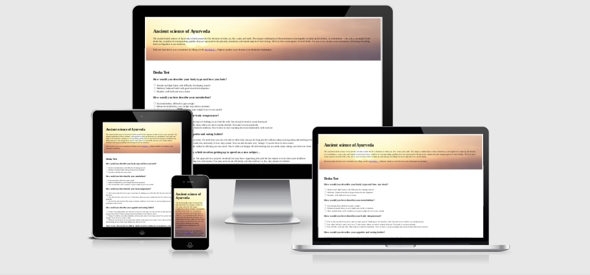
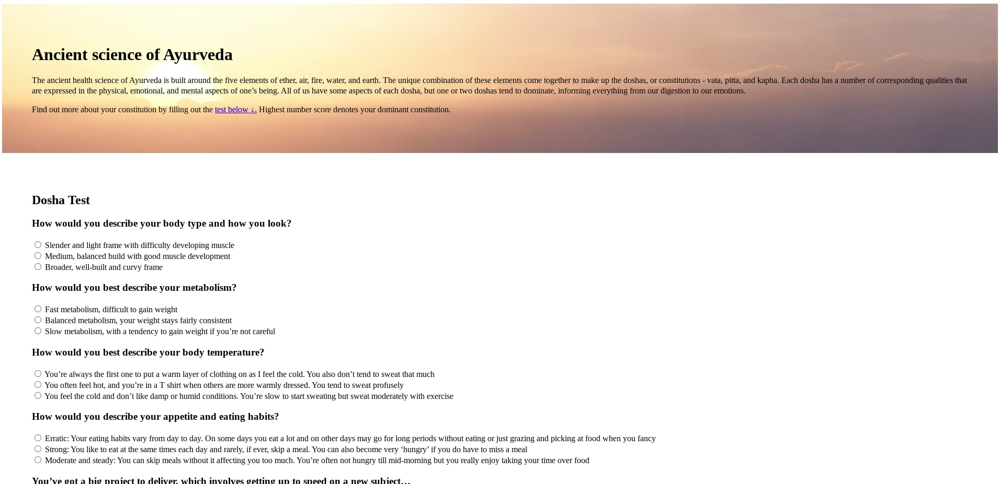
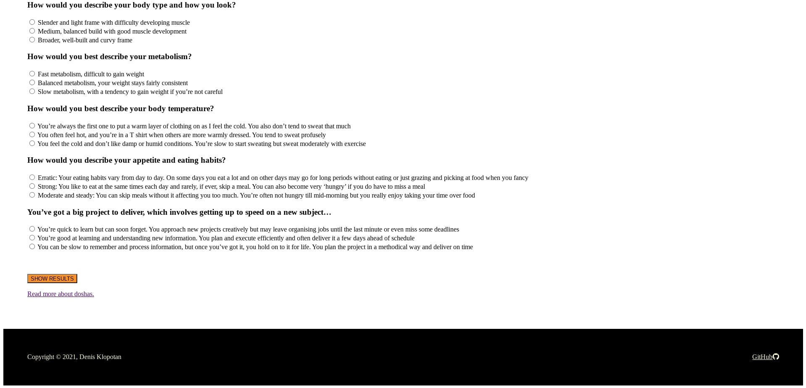
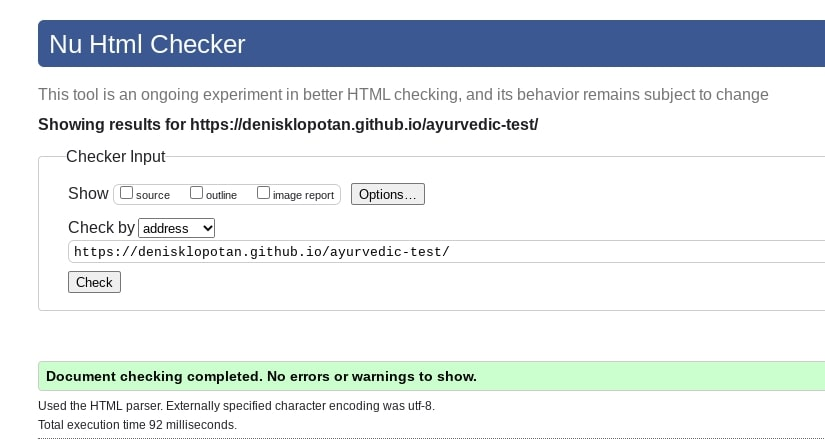
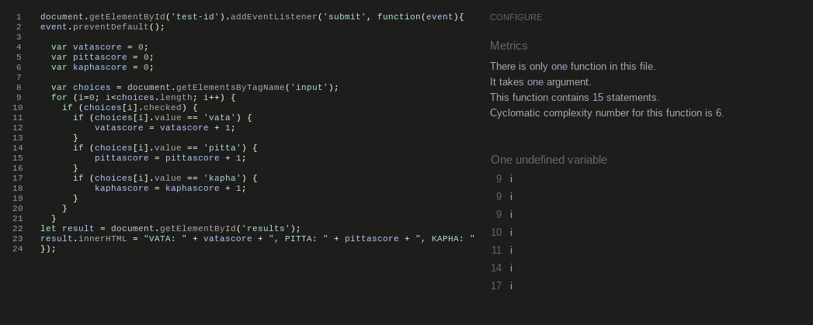
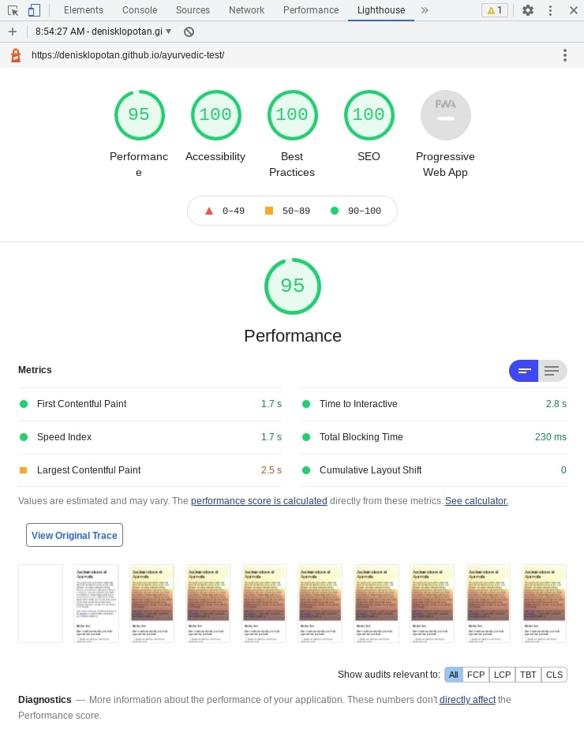

# Ayurvedic 'Dosha test'

Dosha test in this project is made fairly simple and its main purpose is to introduce ancient ayurvedic system of medicine and wellbeing. Answering to specific questions idividual is getting more insight about his body functioning and trough additional research can find how to improve his/her wellbeing. Which in turn brings longterm value and benefit. Its also fun discovering more about yourself! :D 

## Features 

### Existing Features

- __Header with introduction__

  - Header and concept of site is made in fairly simple HTML in CSS, putting more focus on form and Javascript.
  - Link in header is internal, linked within the same web page to form section. 

- __Section with form__

  - Form provides 5 questions with topic of Ayurveda. User is able to chose answers that he relates the most and submit answers to get result. 
  - Result tells the user more about his body costitution and below result link is provided for more information.

- __The Footer__ 

  - The footer section includes copyright and authors name + GitHUb link that opens in new tab.
  - The footer is valuable to the user as it provides a link to contact developer.

### Features Left to Implement

- Javascript functions to implement on form, radio button, submit button, styling.

## Testing 

Webpage passed all validator testings with excellent results.
HTML is simply made and responsive on all devices and screen sizes.

Minor future adjustments needed for mobile devices, relating to result area, kapha result is pushed in a new line while resising to mobile size. Would be more estheticaly pleasing to keep results in one line on all devices.

### Validator Testing 

- HTML
  - No errors were returned when passing through the official [NU HTML checker](https://validator.w3.org/nu/)
  - 

- CSS
  - No errors were found when passing through the official [(Jigsaw) validator](http://jigsaw.w3.org/css-validator/validator?uri=https%3A%2F%2Fdenisklopotan.github.io%2Fayurvedic-test%2F&profile=css3svg&usermedium=all&warning=1&vextwarning=)

- JS
  - No errors were found when passing through the official [JShint](https://jshint.com/), only one undefined variable [i]
  - 

- Lightouse
  - Lighthouse validation returned maximum score in 3/4 categories and 95% in 4th. Very good.
  - 
  

### Unfixed Bugs

- Mobile responsivness buttons in one line

## Deployment

- The site was deployed to GitHub pages. The steps to deploy are as follows: 
  - In the GitHub repository, navigate to the Settings tab 
  - From the source section drop-down menu, select the Master Branch
  - Once the master branch has been selected, the page will be automatically refreshed with a detailed ribbon display to indicate the successful deployment. 

The live link can be found here - https://denisklopotan.github.io/ayurvedic-test/

## Credits 

### Content 

- Introduction text was taken from [kripalu.org](https://kripalu.org/content/whats-your-dosha)
- Form material, questions and answers where taken from [pukkaherbs.com](https://www.pukkaherbs.com/uk/en/dosha-quiz)
- Read more material with external link comes from [Healthline](https://www.healthline.com/nutrition/vata-dosha-pitta-dosha-kapha-dosha)
- GitHub icon in the footer was taken from [Font Awesome](https://fontawesome.com/)
- Javascript template was taken and modified from [codepen](https://codepen.io/amyfu/pen/oLChg)

### Media

- Header background image is taken from: [Pixabay](https://pixabay.com/photos/balance-stones-stack-110850/)